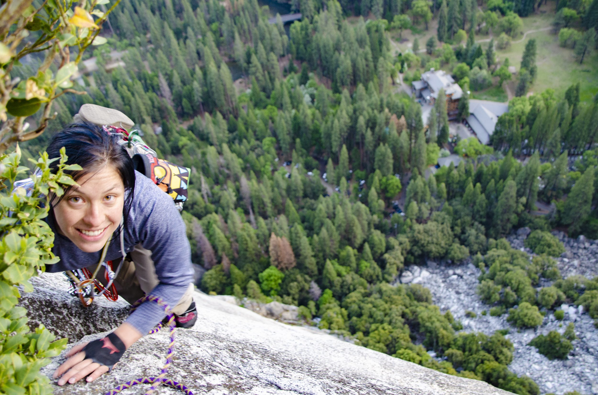

```{r setup, include=FALSE}
knitr::opts_chunk$set(echo = TRUE)
```


<!-- # Stuff I want to have: -->
<!-- # Research Projects - drop-down menu for Schisto, Covid, SNAPP PDEHE -->
<!-- # Other Projects (podcast, Climbers for Bats, Mental Health Awareness) -->
<!-- # Resume / CV -->
<!-- # Blog - sometimes my blog post will be like "new updates on COVID page!" -->
<!-- # Main Page -->
<!-- # Contact Me - maybe move this to the bottom of the website for each page. I think it would be cool to be able to click on the logos for the things at the bottom - for email, Twitter, Instagram -->

\newline
\newline
\newline

<center>### Chloe Rickards
<center>### University of California Santa Cruz - Kilpatrick Lab

<center>{width=500px}

\newline
Hello! I am a grad student at the University of California - Santa Cruz studying Ecology and Evolutionary Biology - specifically, disease ecology. I'm interested in how changes to the environment create changes in human diseases. I'm currently working on two projects: studying genetically modified organisms in the snail host for the parasitic disease schistosomiasis, and monitoring the current SARS-COV-2 epidemic
\newline

<!-- # link these together -->
My current projects are: 
* Age-Stratified IFR Estimates for SARS-CoV-2
* Schistosomiasis and CRISPR/Cas9 Gene Drives
* Science Writing and Education

<!-- # twitter, instagram, other links -->

<!-- How to update this site:  -->
<!-- make edits -->
<!-- Knit to preview in Rmd -->
<!-- rmarkdown::render_site() in Console to upload changes -->
<!-- to push up to github: git add * in Terminal -->
<!-- git commit -m "insert description here" -->
<!-- git push origin master -->