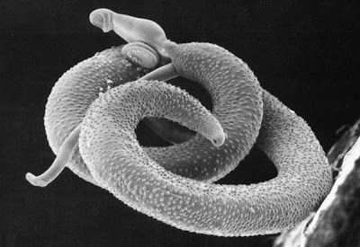

```{r setup, include=FALSE}
knitr::opts_chunk$set(echo = TRUE)
```

# What is Schistosomiasis?
\newline
Schistosomiasis (pronounced shis-toe-so-my-uh-sis) is a Neglected Tropical Disease - meaning many people don't know about it, and it goes unnoticed and untreated. Schistosomiasis is caused by parasitic worms that live in fresh water sources, like rivers and lakes. It infects 200 million people a year, primarily in Africa, and it causes debilitating symptoms such as cognitive impairment and anemia
\newline
<center>{width=500px}

